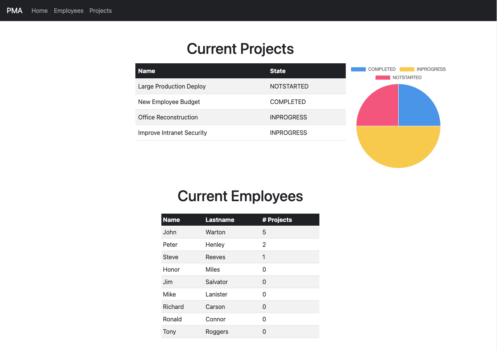

# Project Management App

The Project Management App is a comprehensive web-based solution designed to help companies efficiently manage their projects and employees. This application provides a user-friendly interface for creating, organizing, and tracking projects, assigning tasks to team members, monitoring progress, and facilitating collaboration within the organization.

- [Architectural Design Diagram](https://viewer.diagrams.net/?tags=%7B%7D&highlight=0000ff&edit=_blank&layers=1&nav=1&title=PMA-System-Diagram.drawio#R7VxbU%2BM2FP41zLQPZHxP8ggBum1pS2Gn7T7tKLbiaFe2vLZCkv31lWz5KiUYiGPDZmCG6PhIlo6%2B852jCzkzZ8HmlxhEyz%2BIB%2FGZoXmbM%2FPqzDB0wx6zP1yyzSTjqZMJ%2FBh5QqkUPKDvUAg1IV0hDyY1RUoIpiiqC10ShtClNRmIY7Kuqy0Irr81Aj6UBA8uwLL0X%2BTRZSad2Fop%2FwCRv8zfrGviSQByZSFIlsAj64rIvD4zZzEhNPsUbGYQc%2BPldsnq3ex4WnQshiFtU2Ezof71p3vjcWsD69vX2c1v35Nzx86aeQR4JUYseku3uQmgxywiiiSmS%2BKTEODrUnoZk1XoQf4ejZVKnVtCIibUmfALpHQrphesKGGiJQ2weApD74JPFiuGJISZ5AZhLJrM%2BsQ7snPwQpSQVezCfSM2BYpA7EO6R1EvJ4mhG5IA0njLKsYQA4oe6z0BAmZ%2BoVfOBPsgJuM5E2M%2BPTF1s6%2BXiMKHCKSjXzNvrJtYNAdjCjf7jSgPWVRgzjuaTrNawp3tqQDQunQOZyoQv6w6hm13ZCnZUB8ojZjkHn5bwYT2geeEoYs2EJ3KusF0ToxPQdroE9H6MKimNjUuBkmC3MbsHJmR2s6ebr1y%2BtKqbFRgW1GICAppUmn5jgtKpy8CmvB4y9YaUMhaLIFRdO0VWJGg8g%2BC6z0EqB%2BFAK26Kcw8tFfITzcU5OdoHfnUm3KpA7qM0dJlXusxryM8p59UivX9v2rhE29sZOfFq41oPCttRalNyKqQYjnNJS%2F2NMn98KJp2MfnRVMmxl4xpo2s6biKM32k6foTSEtLdzBGzBowlqHVdbxtiytj2id7GNJMzwgzHMGY2azvQGg4dfD3HwnHg3CM40dCqyWYnT6xbE4GMTsV2rJrpPUkYR2Nm9pOp9nrUs6SpvMBxo%2BIjczQbsF2AARlDY6g7BYbOu9sp60llq1Jn1h2pGm5DhFl%2BEx6B7EzOBDrb4q3jx%2BN81OLzhemL1qy2I0li60dYytHkxzsjiTUj%2BHD37cSmpIliPhHd4sRA01sPu1o8wxet%2FNCANyvfgq6v1aUNQPz5CzDl24fxjvtSWMB6MjeOVE457Qz5zTfunN%2BXKJwIA762nz5RQ467sVB5WxOHOM6mHJ3Ytmc4%2FNPP9HlNoAYggW3IAwiZguY%2FNx7nNQb%2B7KWKk5ax4yThpxVMKOocopkjQIM0kRswdb3ubNyD3GXCHssnWYVmYQ5hfs1L10uSYy%2BM31QW3kKJ2VvZ60x%2F5kRTOIy0ysrPfDGxGtiyInxLre23hD9ATY1xVuQ0LyDBGMQJWiOc4oNmFuh8JJQSoKzox1L2s6o4TjFoUUVAeZ4ZMsYKICx04uDzT10KQh9DKsvbbzRlN84VkDObLwNYArjkPnRJXeaRELeARzcUO2NMMOznjjfVvz6wSV%2FZ6XQwCibGppCLCZfYY6pM8N03AmcLxpYY3IPwMmCZ1oAI58R%2BhWGC94An2XkAnwhxJSHmMuEYQOF%2Fm2qc2WVknthNS4irO4Cp7FiiTwPhmnoooCCeeEvgl1ZF%2BxL9suGN%2BMxyWZdmrGyXpbZL1eP6YyEbFQApUCDDNlrfmB8GNDuIQYZygJFOW88Ddtc8%2FDUpdqrkdDCyZ9sISe0UtqMF%2Fvr3YT8RO%2FZoPOcuWM3CY7JF4uF4b5n0NUztc4gaBttIWhNuoLgtA0Eo5h8Ybz8XASW1V4IwIkxNx0FAD0bTjzrHQOwM8g9I1rvC9av26I2JMzdw4gkiBLR%2BilrO%2BwOrSJrs1vjYLwn%2FL2LpM2UV2UZmV2LCLoHnafQ2VHo3HXq8vzszeqKxlQ3gjhs7rKw9wLUnOLdoXHSnuY6y%2FIteU2YE8sp2B0%2B2BX%2FL5AzhSrjsRWRpzjeOTwCdq3z8iXar6z2BStjEvq7MusFihP6Jwh4jM20H2iMdutj8Cx1GACEW%2BqWeb1Qv0X87rcDAj6daRXBgYXQb5%2F3C3gqEHtiPzW3PCtKqqA%2F7SpG5kng2zx4f%2B2ZhHToMNHHNW4y7QblZGclolZpe7khq96QZWkjTZ%2BUP%2FVms7MaqdlDJdC2fFWy8P9TgOs6wJkTRYBTnYZ2F%2BDyjSwpwIlI0Sa%2Bhe1jFZt8v62uBxM3RhFFJGwdCYt9053hrUzgTvGty%2Fhm73CFPfFNeQ%2Bgs%2FgmHz7msPLQYw0M%2BebnnGzOGbFwAJoXcxJ7MD5nMm7FbBQX6R4dP%2BAvb1ekODShxX%2F4XADPyxowok1q4Mq%2BbApFWAIUi93YtEM50DNpBgdVL6W%2BcLY%2Bz651XOgwaLxUc5mxil5V2jEkLYHWmpYmD6Do4px4W0kYSxIvl9z9XhlzKZYVcxN9Rt7eGlwov29PD1TE0rJHaQ7erJ1m%2Fp8zfmw%2BY1l%2B7Un7EXChyrZcnsHCUZOampYa3FUhoEWaeFX5QEUXBwiMpmaPHKMWGx1LERv1cjf0KJeFbNWh8BBIIioWaSeOUCsKCw2HItQsIBKipriW%2B5z4wTKtkTkeID%2BotocGxA%2Bff9xk4qZvomjdgVdlM%2B%2FP123HGU0G6Ov5NcjB%2BfoqgXHy4zl460yA2%2BdliXYneUAEkmTNsCA3AEM%2BTYoHJ1rg35czUFpQ%2FbP5EGgBrCjfRqUInshht2JupW1Pwf%2Fl5PT%2BXHximKOxNUAXl28ZXXEgf%2BRmlv9ZQWwdV%2ByV29ZlhuDf5SDtDwfI89IDNJVlX3Av54kMa1q%2F4OUoztkdxV5s84JXCwOzYvndfdmhVfkNiOb1%2Fw%3D%3D#%7B%22pageId%22%3A%22V5eDueEhGRVcFU81uOzd%22%7D)

## Features

- **Project Management**: Create, edit, and delete projects with detailed descriptions, deadlines, and associated tasks.
- **Task Assignment**: Assign tasks to employees and track their status, priority, and completion status.
- **Employee Management**: Maintain employee profiles, roles, and contact information for effective communication and coordination.
- **Authentication & Authorization**: Secure login mechanism with role-based access control to ensure data privacy and integrity.
- **Reporting & Analytics**: Generate reports and analytics on project performance, task completion rates, and employee productivity.
- **Notifications**: Receive timely notifications and updates on project milestones, task assignments, and deadline reminders.

## Technologies Used

- **Framework**: Spring Framework
- **UI**: Thymeleaf (MVC approach)
- **Database**: PostgreSQL
- **Persistence**: JPA (Java Persistence API)
- **Authentication**: Spring Security
- **Testing**: JUnit
- **Build Tool**: Maven

## Prerequisites

- Java Development Kit (JDK) 17 or higher
- Apache Maven
- PostgreSQL database server
